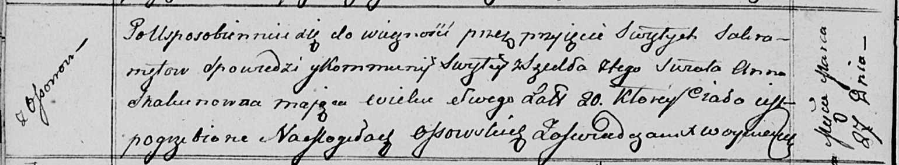

**Скакун Анна (Skakunowna Anna)**

27 марта 1813 г -- отпевание, умерла в возрасте 20 лет (родилась около
1793 г) (НИАБ 136-13-919, лист 26об, №29/1813-у (ориг)).

**НИАБ 136-13-919:** Лист 26об. **Метрическая запись №29/1813-у
(ориг).**

Осовская униатская церковь. 27 марта 1813 года. Метрическая запись об
отпевании.

Skakunowna Anna -- умершая, 20 лет, с деревни Осово, похоронена на
кладбище деревни Осово.

Woyniewicz Tomasz -- ксёндз.
