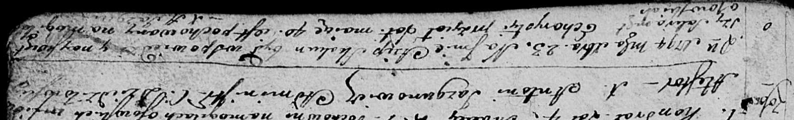

**Скакун Асип (Skakun Asip)**

23 декабря 1794 г -- отпевание, умер в возрасте 40 лет (родился около
1754 г) (НИАБ 136-13-919, лист 3, №53/1794-у (ориг)).

**НИАБ 136-13-919:** Лист 3. **Метрическая запись №53/1794-у (ориг).**

Дедиловичская Покровская церковь. 23 декабря 1794 года. Метрическая
запись об отпевании.

Skakun Asip -- умерший, 40 лет, с деревни Осово, похоронен на кладбище
деревни Осово.

Jazgunowicz Antoni -- ксёндз.
