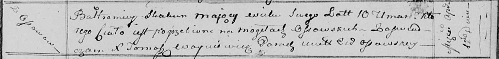

**Скакун Балтромей (Skakun Bałtromiey)**

1 апреля 1815 г -- отпевание, умер в возрасте 10 лет (родился около 1805
г) (НИАБ 136-13-919, лист 29, №12/1815-у (ориг)).

**НИАБ 136-13-919:** Лист 29. **Метрическая запись №12/1815-у (ориг).**

Осовская униатская церковь. 1 апреля 1815 года. Метрическая запись об
отпевании.

Skakun Bałtromiey -- умерший, 10 лет, с деревни Осово, похоронен на
кладбище деревни Осово.

Woyniewicz Tomasz -- ксёндз.
