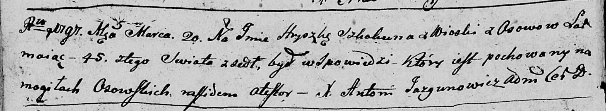

**Скакун Грышка (Skakun Hryszka)**

20 марта 1797 г -- отпевание, умер в возрасте 45 лет (родился около 1752
г) (НИАБ 136-13-919, лист 6об, №4/1797-у (ориг)).

**НИАБ 136-13-919:** Лист 6об. **Метрическая запись №4/1797-у (ориг).**

Дедиловичская Покровская церковь. 20 марта 1797 года. Метрическая запись
об отпевании.

Skakun Hryszka -- умерший, 45 лет, с деревни Осово, похоронен на
кладбище деревни Осово.

Jazgunowicz Antoni -- ксёндз.
