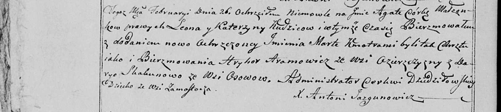

**Скакун Дарыя (Skakunowa Darya)**

26 февраля 1800 г -- крестная мать Агаты Марты, дочери Кудичей Леона и
Катерыны с деревни Замосточье (НИАБ 136-13-949, лист 101об, №8/1800-р
(коп)).

**НИАБ 136-13-949:** Лист 101об. **Метрическая запись №8/1800-р (коп).**

(См. тж.: РГИА 823-2-18, лист 274об, №8/1800-р (коп), НИАБ 136-13-894,
лист 40об, №8/1800-р (ориг))

{width="6.496527777777778in"
height="1.4590277777777778in"}

Дедиловичская Покровская церковь. 26 февраля 1800 года. Метрическая
запись о крещении.

Kudzicowna Agata Marta -- дочь родителей с деревни Замосточье.

Kudzic Leon -- отец.

Kudzicowa Katerzyna -- мать.

Aramowicz Hryhor -- кум, с деревни Озерщизна.

Skakunowa Darya - кума, с деревни Осово.

Jazgunowicz Antoni -- ксёндз.
