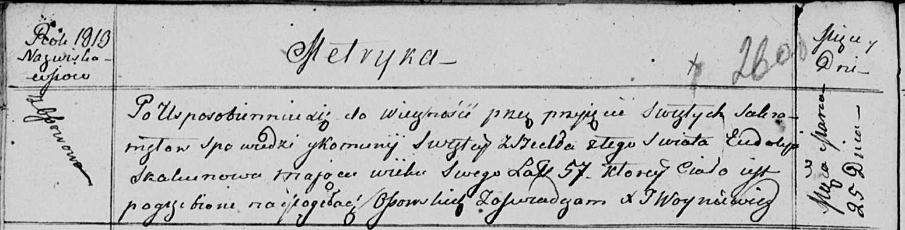

**Скакун Евдокия (Skakunowa Eudokija)**

20 августа 1799 г -- крестная мать Анны Юстыны, дочери Скакунов Василя и
Кулины с деревни Осово (НИАБ 136-13-938, лист 243, №31/1799-р (коп).

25 марта 1813 г -- отпевание, умерла в возрасте 57 лет (родилась около
1756 г) (НИАБ 136-13-919, лист 26об, №28/1813-у (ориг)).

**НИАБ 136-13-938:** Лист 243. **Метрическая запись №31/1799-р (коп).**

(См. тж. НИАБ 136-13-894, лист 39об, №33/1799-р (ориг); РГИА 823-2-18,
лист 271, №32/1799-р (коп))

{width="6.496527777777778in"
height="1.3791666666666667in"}

Дедиловичская Покровская церковь. 20 августа 1799 года. Метрическая
запись о крещении.

Skakunowna Anna Justyna -- дочь родителей с деревни Осово.

Skakun Wasil -- отец.

Skakunowa Kulina -- мать.

Woynicz Chwiedor -- кум.

Skakunowa Ewdokia - кума, с деревни Осово.

Jazgunowicz Antoni -- ксёндз.

**НИАБ 136-13-919:** Лист 26об. **Метрическая запись №28/1813-у
(ориг).**

{width="6.496527777777778in"
height="1.6604166666666667in"}

Осовская униатская церковь. 25 марта 1813 года. Метрическая запись об
отпевании.

Skakunowa Eudokija -- умершая, 57 лет, с деревни Осово, похоронена на
кладбище деревни Осово.

Woyniewicz Tomasz -- ксёндз.
