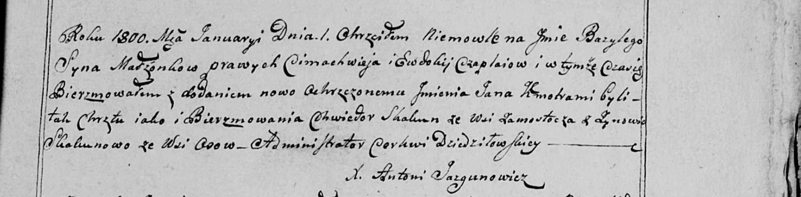

**Скакун Зыновия (Skakunowa Zynowia)**

1 января 1800 г -- крестная мать Базылия Прохора, сына Цимахвея и
Евдокии Чапляев (НИАБ 136-13-949, лист 101, №1/1800-р (коп)).

**НИАБ 136-13-949:** Лист 101. **Метрическая запись №1/1800-р (коп).**

(См. тж.: РГИА 823-2-18, лист 274, №1/1800-р (коп), НИАБ 136-13-894,
лист 40, №1/1800-р (ориг))

Дедиловичская Покровская церковь. 1 января 1800 года. Метрическая запись
о крещении.

Czaplay Bazyli Jan -- сын родителей с деревни \[Осово\].

Czaplay Cimachwiey -- отец.

Czaplaiowa Ewdokija -- мать.

Skakun Chwiedor -- кум, с деревни Замосточье.

Skakunowa Zynowia - кума, с деревни Осово.

Jazgunowicz Antoni -- ксёндз.
