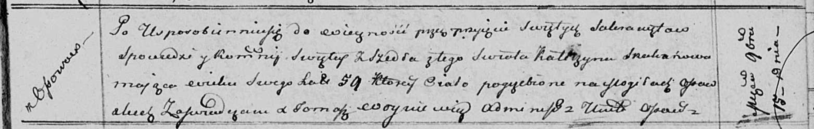

**Скакун Катерина (Skakunowa Katerzyna)**

15 ноября 1811 г -- отпевание, умерла в возрасте 59 лет (родилась около
1752 г) (НИАБ 136-13-919, лист 23, №19/1811-у (ориг)).

**НИАБ 136-13-919:** Лист 23. **Метрическая запись №19/1811-у (ориг).**

Осовская униатская церковь. 15 ноября 1811 года. Метрическая запись об
отпевании.

Skakunowa Katerzyna -- умершая, 59 лет, с деревни Осово, похоронена на
кладбище деревни Осово.

Woyniewicz Tomasz -- ксёндз.
