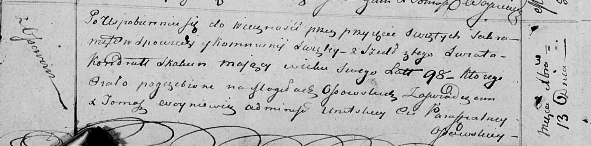

**Скакун Кондрат (Skakun Kondrat)**

13 декабря 1813 г -- отпевание, умер в возрасте 98 лет (родился около
1715 г) (НИАБ 136-13-919, лист 27об, №52/1813-у (ориг)).

**НИАБ 136-13-919:** Лист 27об. **Метрическая запись №52/1813-у
(ориг).**

Осовская униатская церковь. 13 декабря 1813 года. Метрическая запись об
отпевании.

Skakun Kondrat -- умерший, 98 лет, с деревни Осово, похоронен на
кладбище деревни Осово.

Woyniewicz Tomasz -- ксёндз.
