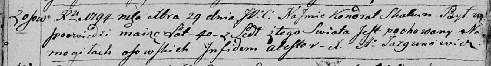

**Скакун Кондрат (Skakun Kondrat)**

29 декабря 1794 г -- отпевание, умер в возрасте 40 лет (родился около
1754 г) (НИАБ 136-13-919, лист 3об, №56/1794-у (ориг)).

**НИАБ 136-13-919:** Лист 3об. **Метрическая запись №56/1794-у (ориг).**

Дедиловичская Покровская церковь. 29 декабря 1794 года. Метрическая
запись об отпевании.

Skakun Kondrat -- умерший, 40 лет, с деревни Осово, похоронен на
кладбище деревни Осово.

Jazgunowicz Antoni -- ксёндз.
