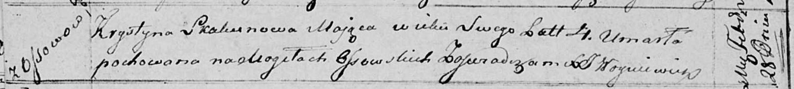

**Скакун Крыстына (Skakunowa Krystyna)**

28 февраля 1818 г -- отпевание, умерла в возрасте 4 лет (родилась около
1814 г) (НИАБ 136-13-919, лист 31об, №4/1818-у (ориг)).

**НИАБ 136-13-919:** Лист 31об. **Метрическая запись №4/1818-у (ориг).**

Осовская униатская церковь. 28 февраля 1818 года. Метрическая запись об
отпевании.

Skakunowa Krystyna -- умершая, 4 года, с деревни Осово, похоронена на
кладбище деревни Осово.

Woyniewicz Tomasz -- ксёндз.
