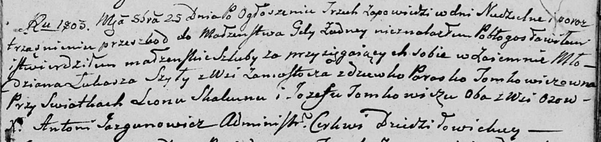

**Скакун Леон (Skakun Leon)**

25 октября 1803 г -- свидетель венчания молодого Лукаша Шило с деревни
Замосточье с девкой Параской Томкович (НИАБ 136-13-920, лист 9,
№4/1803-б (ориг)).

**НИАБ 136-13-920:** Лист 9. **Метрическая запись №4/1803-б (ориг).**

Дедиловичская Покровская церковь. 25 октября 1803 года. Метрическая
запись о венчании.

Szyło Łukasz -- жених, молодой, с деревни Замосточье.

Tomkowiczowna Paraska -- невеста, девка.

Skakun Leon -- свидетель, с деревни Осовo.

Tomkowicz Jozef -- свидетель, с деревни Осовo.

Jazgunowicz Antoni -- ксёндз.
