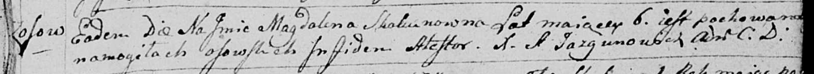

**Скакун Магдалена (Skakunowna Magdalena)**

12 декабря 1794 г -- отпевание, умерла в возрасте 6 лет (родилась около
1788 г) (НИАБ 136-13-919, лист 3, №45/1794-у (ориг)).

**НИАБ 136-13-919:** Лист 3. **Метрическая запись №45/1794-у (ориг).**

Дедиловичская Покровская церковь. 12 декабря 1794 года. Метрическая
запись об отпевании.

Skakunowna Magdalena -- умершая, 6 лет, с деревни Осово, похоронена на
кладбище деревни Осово.

Jazgunowicz Antoni -- ксёндз.
