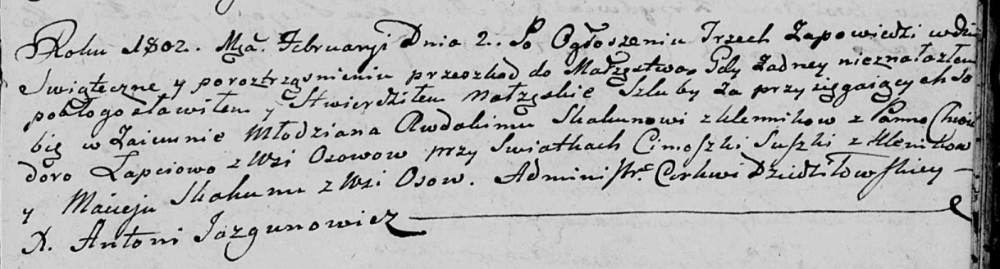

**Скакун Майсей (Skakun Maisey)**

2 февраля 1802 г -- свидетель венчания молодого Авдакима Скакуна с
деревни Клинники с Хведорой Лапец с деревни Осово (НИАБ 136-13-920, лист
8, №2/1802-б (ориг)).

**НИАБ 136-13-920:** Лист 8. **Метрическая запись №2/1802-б (ориг).**

Дедиловичская Покровская церковь. 2 февраля 1802 года. Метрическая
запись о венчании.

Skakun Awdakim -- жених, молодой, с деревни Клинники.

Łapciowa Chwiedora -- невеста, с деревни Осовo.

Suszko Cimoszka -- свидетель, с деревни Клинники.

Skakun Maisey -- свидетель, с деревни Осовo.

Jazgunowicz Antoni -- ксёндз.
