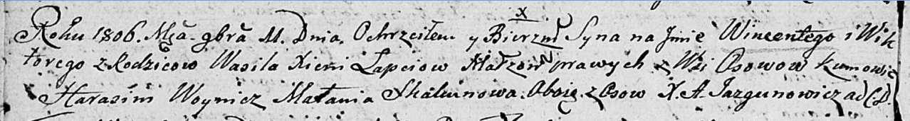

**Скакун Малания (Skakunowa Małania)**

11 ноября 1806 г -- крестная мать Винцентыя Викторыя, сына Лапецов
Василя и Ксени с деревни Осово (НИАБ 136-13-894, лист 61об, №49/1806-р
(ориг)).

**НИАБ 136-13-894:** Лист 61об. **Метрическая запись №49/1806-р
(ориг).**

Дедиловичская Покровская церковь. 11 ноября 1806 года. Метрическая
запись о крещении.

Łapać Wincenty Wiktory -- сын родителей с деревни Осовo.

Łapać Wasil -- отец.

Łapaciowa Xienia -- мать.

Woynicz Harasim -- кум, с деревни Осовo.

Skakunowa Małania -- кума, с деревни Осовo.

Jazgunowicz Antoni -- ксёндз.
