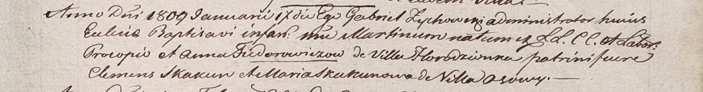

**Скакун Мария (Skakun Maria)**

17 января 1809 г -- крестная мать Мартина, сына Прокопа и Анны
Фендоровичей с застенка Городенка (НИАБ 937-4-32, лист 19, №2/1809-р).

**НИАБ 937-4-32:** Лист 19. **Метрическая запись №2/1809-р.**

Дедиловичский костел Наисвятейшего Сердца Иисуса. 17 января 1809 года.
Метрическая запись о крещении.

Fiedorowicz Martin -- сын крестьян с деревни Городянка.

Fiedorowicz Procop -- отец.

Fiedorowiczowa Anna -- мать.

Skakun Clemens -- крестный отец.

Skakunowa Maria -- крестная мать, с деревни Осово.

Zychowski Gabriel -- ксёндз.
