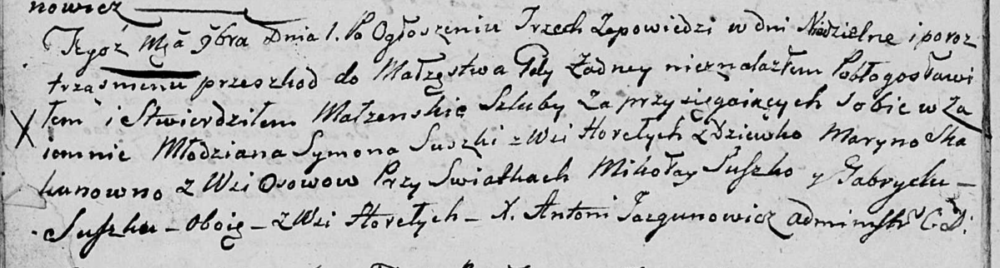

**Сушко Марыя, Марьяна, Марына (Suszkowa Marya, Marjana, Maryna)**

1 ноября 1803 г -- венчание с молодым Сымоном Сушко с деревни Горелое
(НИАБ 136-13-920, лист 9об, №9/1803-б (ориг)).

**НИАБ 136-13-920:** Лист 9об. **Метрическая запись №9/1803-б (ориг).**

Дедиловичская Покровская церковь. 1 ноября 1803 года. Метрическая запись
о венчании.

Suszko Symon -- жених, молодой, с деревни Горелое.

Skakunowna Maryna -- невеста, девка, с деревни Осовo.

Suszko Mikołay -- свидетель, с деревни Горелое.

Suszko Gabriel -- свидетель, с деревни Горелое.

Jazgunowicz Antoni -- ксёндз.
