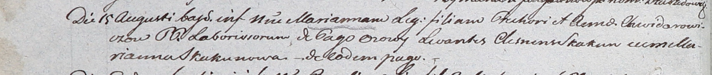

**Скакун Марьяна (Skakunowa Marianna)**

15 августа 1803 г -- крестная мать Марьяны, дочери Грегора и Анны
Федоровичей с деревни Осово (НИАБ 937-4-32, лист 9об, №19/1803-р).

**НИАБ 937-4-32:** Лист 9об. **Метрическая запись №19/1803-р.**

Дедиловичский костел Наисвятейшего Сердца Иисуса. 15 августа 1803 года.
Метрическая запись о крещении.

Chwiedorowiczowna Marianna -- дочь крестьян с деревни Осово.

Chwiedorowicz Grehor -- отец.

Chwiedorowiczowa Anna -- мать.

Skakun Clemens -- крестный отец, с деревни Осово.

Skakunowa Marianna -- крестная мать, с деревни Осово.

Galinowski Joann -- ксёндз, комендант Дедиловичского костела.
