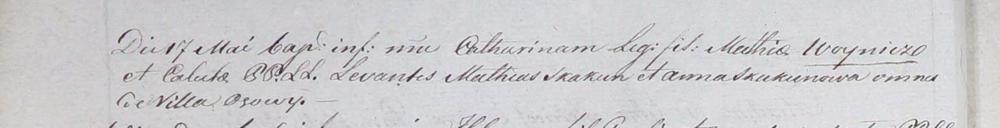

**Скакун Мацей (Skakun Mathias)**

17 мая 1801 г -- крестный отец Катарины, дочери Мацея и Калюхи Войничев
с деревни Осово (НИАБ 937-4-32, лист 4об, №10/1800-р).

**НИАБ 937-4-32:** Лист 4об. **Метрическая запись №10/1801-р.**

{width="6.496527777777778in"
height="0.8333333333333334in"}

Дедиловичский костел Наисвятейшего Сердца Иисуса. 17 мая 1801 года.
Метрическая запись о крещении.

Woyniczowna Catharina -- дочь крестьян с деревни Осово.

Woynicz Mathias -- отец.

Woyniczowa Caluha \[Cecylia\] -- мать.

Skakun Mathias -- крестный отец, с деревни Осово.

Skakunowa Anna -- крестная мать, с деревни Осово.

Linhart Hyacinthus -- ксёндз.
