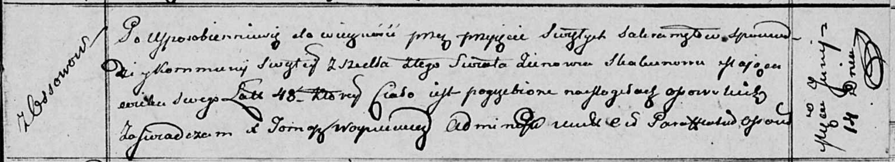

**Скакун Миколай (Skakun Mikołay)**

15 декабря 1794 г -- отпевание, умер в возрасте 1 год (родился около
1793 г) (НИАБ 136-13-919, лист 3, №46/1794-у (ориг)).

**НИАБ 136-13-919:** Лист 3. **Метрическая запись №46/1794-у (ориг).**

{width="6.496527777777778in"
height="0.7527777777777778in"}

Дедиловичская Покровская церковь. 15 декабря 1794 года. Метрическая
запись об отпевании.

Skakun Mikolay -- умерший, 1 год, с деревни Осово, похоронен на кладбище
деревни Осово.

Jazgunowicz Antoni -- ксёндз.
