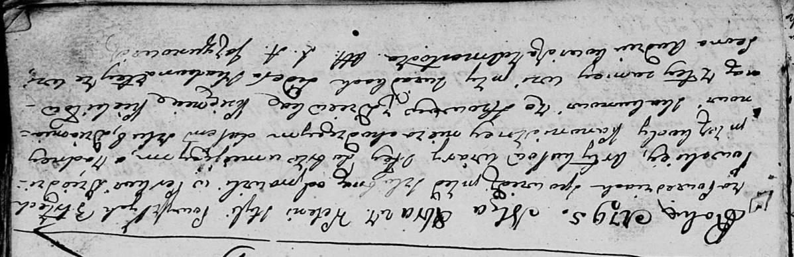

**Скакун Сидер (Skakun Sider)**

27 октября 1795 г -- свидетель венчания Демьяна Скакуна с деревни Осово
и Ксени Кикило с деревни Осово (НИАБ 136-13-920, лист 2, №6/1795-б
(ориг)).

**НИАБ 136-13-920:** Лист 2. **Метрическая запись №6/1795-б (ориг).**

Дедиловичская Покровская я церковь. 27 октября 1795 года. Метрическая
запись о венчании.

Skakun Dziamjan -- жених, с деревни Осово.

Kikiłowna Xienia -- невеста, девка, с деревни Осово.

Skakun Sider -- свидетель, с деревни Осово.

Audziuchowicz Leon -- свидетель, деревня Замосточье.

Jazgunowicz Antoni -- ксёндз.
