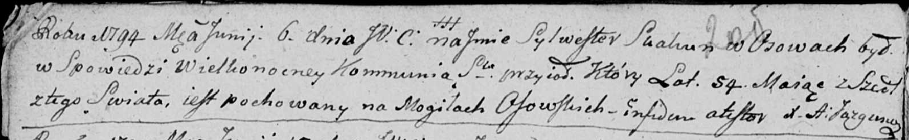

**Скакун Сыльвестер (Skakun Sylwester)**

6 июня 1794 г -- отпевание, умер в возрасте 54 года (родился около 1740
г) (НИАБ 136-13-919, лист 2об, №26/1794-у (ориг))

**НИАБ 136-13-919:** Лист 2об. **Метрическая запись №26/1794-у (ориг).**

Дедиловичская Покровская церковь. 6 июня 1794 года. Метрическая запись
об отпевании.

Skakun Sylwester -- умерший, 54 года, с деревни Осово, похоронен на
кладбище деревни Осово.

Jazgunowicz Antoni -- ксёндз.
