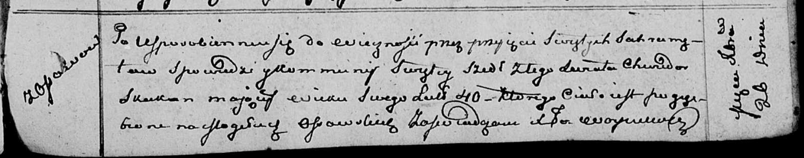

**Скакун Хведор (Skakun Chwiedor)**

26 декабря 1811 г -- отпевание, умер в возрасте 40 лет (родился около
1771 г) (НИАБ 136-13-919, лист 23, №22/1811-у (ориг)).

**НИАБ 136-13-919:** Лист 23. **Метрическая запись №22/1811-у (ориг).**

Осовская униатская церковь. 26 декабря 1811 года. Метрическая запись об
отпевании.

Skakun Chwiedor -- умерший, 40 лет, с деревни Осово, похоронен на
кладбище деревни Осово.

Woyniewicz Tomasz -- ксёндз.
