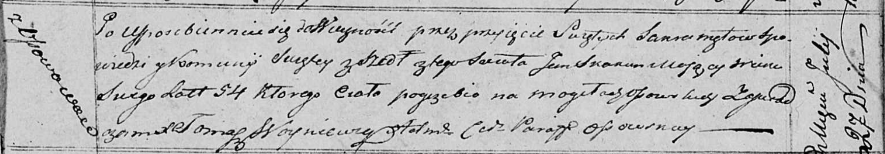

**Скакун Ян (Skakun Jan)**

27 июля 1818 г -- отпевание, умер в возрасте 54 лет (родился около 1763
г) (НИАБ 136-13-919, лист 32, №15/1818-у (ориг)).

**НИАБ 136-13-919:** Лист 32. **Метрическая запись №15/1818-у (ориг).**

Осовская униатская церковь. 27 июля 1818 года. Метрическая запись об
отпевании.

Skakun Jan -- умерший, 54 года, с деревни Осово, похоронен на кладбище
деревни Осово.

Woyniewicz Tomasz -- ксёндз.
