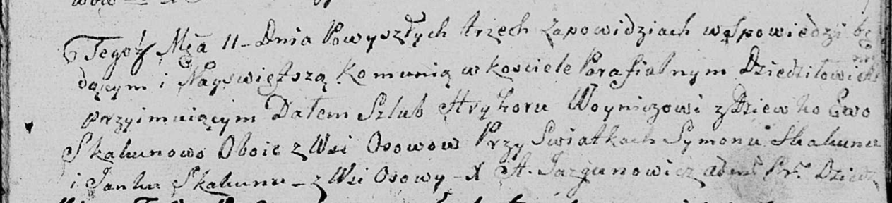

**Скакун Янка (Skakun Janka)**

20 февраля 1804 г -- свидетель венчания молодого Карпа Лапеца с деревни
Клинники с девкой Агапой Церах с деревни Клинники (НИАБ 136-13-920, лист
10об, №4/1804-б (ориг)).

11 ноября 1809 г -- свидетель венчания Грыгора Войнича с деревни Осово с
девкой Евой Скакун с деревни Осово (НИАБ 136-13-920, лист 16, №22/1809-б
(ориг)).

**НИАБ 136-13-920:** Лист 10об. **Метрическая запись №4/1804-б (ориг).**

{width="6.496527777777778in"
height="1.442257217847769in"}

Дедиловичская Покровская церковь. 20 февраля 1804 года. Метрическая
запись о венчании.

Łapac Karp -- жених, молодой, с деревни Клинники.

Cierachowna Ahapa -- невеста, девка, с деревни Клинники.

Łapac Jakub -- свидетель, с деревни Клинники.

Skakun Janka -- свидетель, с деревни Осовo.

Jazgunowicz Antoni -- ксёндз.

**НИАБ 136-13-920:** Лист 16. **Метрическая запись №22/1809-б (ориг).**

{width="6.496527777777778in"
height="1.4811461067366578in"}

Дедиловичская Покровская церковь. 11 ноября 1809 года. Метрическая
запись о венчании.

Woynicz Hryhor -- жених, с деревни Осовo.

Skakunowa Ewa -- невеста, девка с деревни Осовo.

Skakun Symon -- свидетель.

Skakun Janka -- свидетель, с деревни Осовo.

Jazgunowicz Antoni -- ксёндз.
