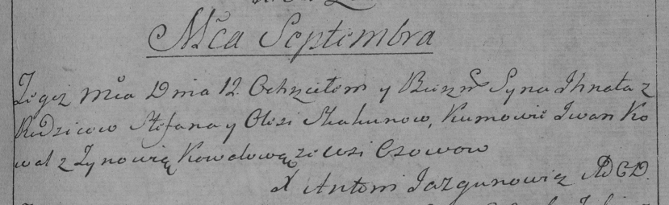

**Скакун Игнат Степанов (Skakun Jhnat)**

12 сентября 1792 г -- крещение (НИАБ 136-13-893, лист 17, №56/1792-р
(ориг)), (РГИА 823-2-18, лист 245, №25/1792-р (коп))

**НИАБ 136-13-894:** Лист 17. **Метрическая запись №56/1792-р (ориг).**

{width="6.496527777777778in"
height="0.6731878827646545in"}

Дедиловичская Покровская церковь. 12 сентября 1792 года. Метрическая
запись о крещении.

Skakun Jhnat -- сын родителей с деревни Осовo.

Skakun Stefan -- отец.

Skakunowa \...sina -- мать.

Kawal Jhnat - кум.

Kawalowa Zynowija - кума.

Jazgunowicz Antoni -- ксёндз.

**РГИА 823-2-16:** Лист 245. **Метрическая запись №25/1792-р (коп).**

{width="6.496527777777778in"
height="1.9986111111111111in"}

Дедиловичская Покровская церковь. 12 сентября 1792 года. Метрическая
запись о крещении.

Skakun Jhnat -- сын родителей с деревни Осово.

Skakun Stefan -- отец.

Skakunowa Elesia? -- мать.

Kowal \[Jhnat\] -- кум.

Kowalowa Zynowia -- кума.

Jazgunowicz Antoni -- ксёндз.
