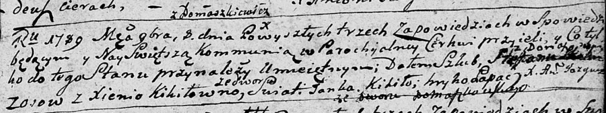
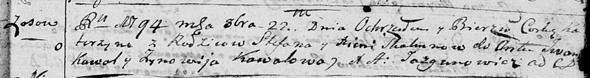

**Скакун (Кикило) Ксеня (Skakunowa Xienia z Kikiłow)**

8 ноября 1789 г -- венчание с Степаном Скакуном с деревни Осово (НИАБ
136-13-893, лист 68, №9/1789-б (ориг))

22 октября 1794 г -- крещение дочери Катерины (НИАБ 136-13-893, лист 23,
№46/1794-р (ориг))

5 мая 1807 г -- возможно, крестная мать Якуба Антона, сына Новиков
Андрея и Анны с деревни Осово (НИАБ 136-13-894, лист 62об, №23/1807-р
(ориг)).

1 января 1809 г -- возможно, крестная мать Базыля, сыня Чапляев Яна и
Дарыи с деревни Осово (НИАБ 136-13-894, лист 73, №1/1809-р (ориг)).

**НИАБ 136-13-894:** Лист 68. **Метрическая запись №9/1789-б (ориг).**

Дедиловичская Покровская церковь. 8 ноября 1789 года. Метрическая запись
о венчании.

Skakun Stefan -- жених, с деревни Осовo.

Kikiłowna Xienia -- невеста, со двора Домашковичи.

Kikiło Janka -- свидетель.

Łapać Hryhor -- свидетель.

Jazgunowicz Antoni -- ксёндз.

**НИАБ 136-13-894:** Лист 23. **Метрическая запись №46/1794-р (ориг).**

Дедиловичская Покровская церковь. 22 октября 1794 года. Метрическая
запись о крещении.

Skakunowna Katerzyna -- дочь родителей с деревни Осовo.

Skakun Stefan -- отец.

Skakunowa Xienia -- мать.

Kawal Jwan - кум.

Kawalowa Zynowija - кума.

Jazgunowicz Antoni -- ксёндз.

**НИАБ 136-13-894:** Лист 62об. **Метрическая запись №23/1807-р
(ориг).**

Дедиловичская Покровская церковь. 5 мая 1807 года. Метрическая запись о
крещении.

Nowik Jakub Antonij -- сын родителей с деревни Осовo.

Nowik Andrzey -- отец.

Nowikowa Anna -- мать.

Woynicz Władyś -- кум, с деревни Осовo.

Skakunowa Xienia -- кума, с деревни Осовo.

Jazgunowicz Antoni -- ксёндз.

**НИАБ 136-13-894:** Лист 73. **Метрическая запись №1/1809-р (ориг).**

Дедиловичская Покровская церковь. 1 января 1809 года. Метрическая запись
о крещении.

Czaplay Bazilium -- сын родителей с деревни Осово.

Czaplay Joann -- отец, селянин.

Czaplaiowa Daria -- мать, селянка.

Czaplay Silvester -- кум, с деревни Осово.

Skakunowa Xienia -- кума, с деревни Осово.

Zychowski Gabriel -- ксёндз. (лат. язык)
