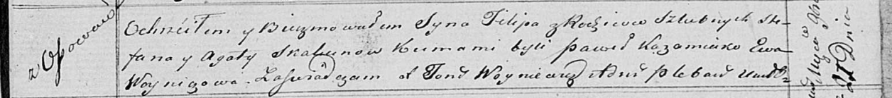

**Скакун Филип Стефанов (Skakun Filip)**

27 ноября 1820 г -- крещение (НИАБ 136-13-893, лист 105, №39/1820-р
(ориг))

**НИАБ 136-13-894:** Лист 105. **Метрическая запись №39/1820-р (ориг).**

Осовская Покровская церковь. 27 ноября 1820 года. Метрическая запись о
крещении.

Skakun Filip -- сын родителей с деревни Осовo.

Skakun Stefan -- отец.

Skakunowa Agata -- мать.

Każamiako Paweł -- кум.

Woyniczowa Ewa -- кума.

Woyniewicz Tomasz -- ксёндз.
