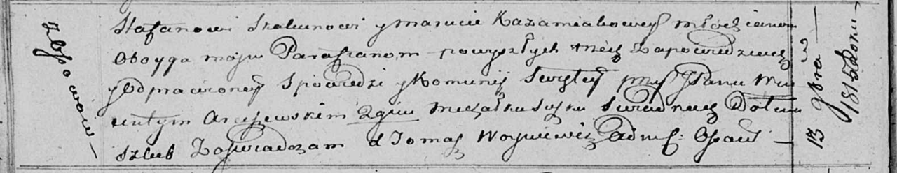

**Скакун (в девичестве Кожемяка) Марута (Skakunowa Maruta z Każamiak)**

13 ноября 1815 г -- венчание с молодым Стефаном Скакуном с деревни Осово
(НИАБ 136-13-920, лист 22об, №11/1815-б (ориг)).

**НИАБ 136-13-920:** Лист 22об. **Метрическая запись №11/1815-б
(ориг).**

Осовская Покровская церковь. 13 ноября 1815 года. Запись о венчании.

Skakun Stefan -- жених, молодой, парафии Осовской, с деревни Осово.

Każamiakowa Maruta -- невеста, девка, парафии Осовской.

Arciszewski Wincenty, JP -- свидетель, шляхтич.

Suszko Michałka -- свидетель.

Woyniewicz Tomasz -- ксёндз.
