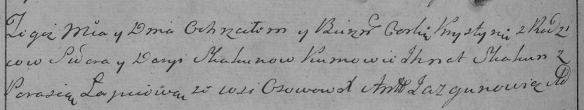

**Скакун Крыстына Сыдорова (Skakunowna Krystyna)**

20 июля 1796 г -- крещение (НИАБ 136-13-894, лист 30, №68/1796-р
(ориг)), (РГИА 823-2-18, лист 256об, №39/1796-р (коп)).

**НИАБ 136-13-894:** Лист 30. **Метрическая запись №68/1796-р (ориг).**

{width="6.496527777777778in"
height="0.7147594050743658in"}

Дедиловичская Покровская церковь. 20 июля 1796 года. Метрическая запись
о крещении.

Skakunowna Krystyna -- дочь родителей с деревни Осовo.

Skakun Syder -- отец.

Skakunowa Daryia -- мать.

Skakun Jhnat - кум.

Łapciowa Parasia - кума.

Jazgunowicz Antoni -- ксёндз.

**РГИА 823-2-18:** Лист 256об. **Метрическая запись №39/1796-р (коп).**

{width="6.496527777777778in"
height="1.2340277777777777in"}

Дедиловичская Покровская церковь. 20 июля 1796 года. Метрическая запись
о крещении.

Skakunowna Krystyna -- дочь родителей с деревни Осово.

Skakun Sider -- отец.

Skakunowa Darya -- мать.

Skakun Jhnat -- кум.

Łapciowa Parasia -- кума.

Jazgunowicz Antoni -- ксёндз.
