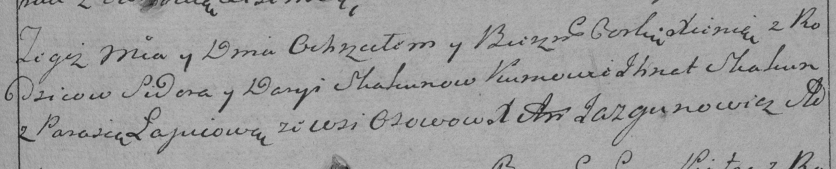

**Скакун Ксеня Сыдорова (Skakunowna Xienia)**

20 января 1790 г -- крещение дочери Ксени (НИАБ 136-13-894, лист 8об,
№6/1790-р (ориг)), (РГИА 823-2-18, лист 239, №3/1790-р (коп)).

**НИАБ 136-13-894:** Лист 8об. **Метрическая запись №6/1790-р (ориг).**

Дедиловичская Покровская церковь. 20 января 1790 года. Метрическая
запись о крещении.

Skakunowna Xienia -- дочь родителей с деревни Осово.

Skakun Sydor -- отец.

Skakunowa Daria -- мать.

Skakun Jhnat - кум.

\...iowa Parasia - кума.

Jazgunowicz Antoni -- ксёндз.

**РГИА 823-2-18:** Лист 239. **Метрическая запись №4/1790-р (коп).**

Дедиловичская Покровская церковь. 20 января 1790 года. Метрическая
запись о крещении.

Skakunowna Xienia -- дочь родителей с деревни Осово.

Skakun Sider -- отец.

Skakunowa Darya -- мать.

Skakun Ihnat -- кум.

Łapciowa Parasia - кума.

Jazgunowicz Antoni -- ксёндз.
