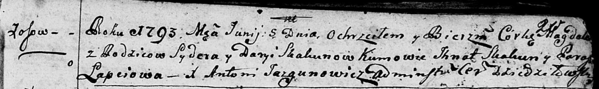

**Скакун Магдалена Сыдорова (Skakunowa Magdalena)**

5 июня 1793 г -- крещение (НИАБ 136-13-894, лист 20, №47/1793-р (ориг)).

**НИАБ 136-13-894:** Лист 20. **Метрическая запись №47/1793-р (ориг).**

Дедиловичская Покровская церковь. 5 июня 1793 года. Метрическая запись о
крещении.

Skakunowna Magdalena -- дочь родителей с деревни Осовo.

Skakun Syder -- отец.

Skakunowa Daryia -- мать.

Skakun Jhnat - кум.

Łapciowa Paraska - кума.

Jazgunowicz Antoni -- ксёндз.
