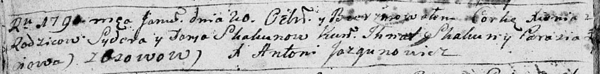

**Скакун Сыдор (Skakun Jsydor, Syder, Sydor)**

29 апреля 1787 г -- крещение сына Марка (НИАБ 136-13-894, лист 1об,
№12/1787-р (ориг)), РГИА 823-18, лист 233об, №10/1787-р (коп)).

20 января 1790 г -- крещение дочери Ксени (НИАБ 136-13-894, лист 8об,
№6/1790-р (ориг)), (РГИА 823-2-18, лист 239, №3/1790-р (коп)).

5 июня 1793 г -- крещение дочери Магдалены (НИАБ 136-13-894, лист 20,
№47/1793-р (ориг)).

20 июля 1796 г -- крещение дочери Крыстыны (НИАБ 136-13-894, лист 30,
№68/1796-р (ориг)), (РГИА 823-2-18, лист 256об, №39/1796-р (коп)).

**НИАБ 136-13-894:** Лист 1об. **Метрическая запись №12/1787-р (ориг).**

{width="6.496527777777778in"
height="1.0379429133858267in"}

Дедиловичская Покровская церковь. 29 апреля 1787 года. Метрическая
запись о крещении.

Skakun Marko - сын родителей с деревни Осово.

Skakun Syder -- отец.

Skakunowa Daryia -- мать.

Skakun Jhnat - кум.

Lapćiowa Parasia - кума.

Jazgunowicz Antoni -- ксёндз.

**РГИА 823-2-18:** Лист 233об. **Метрическая запись №10/1787-р (коп).**

{width="6.496527777777778in"
height="1.9277777777777778in"}

Дедиловичская Покровская церковь. 29 апреля 1787 года. Метрическая
запись о крещении.

Skakun Markо -- сын родителей с деревни Осово.

Skakun Jzydor -- отец.

Skakunowa Darya -- мать.

Skakun Jhnat -- кум.

Łapciowa Paraska - кума.

Jazgunowicz Antoni -- ксёндз.

**НИАБ 136-13-894:** Лист 8об. **Метрическая запись №6/1790-р (ориг).**

{width="6.496527777777778in"
height="0.8072889326334208in"}

Дедиловичская Покровская церковь. 20 января 1790 года. Метрическая
запись о крещении.

Skakunowna Xienia -- дочь родителей с деревни Осово.

Skakun Sydor -- отец.

Skakunowa Daria -- мать.

Skakun Jhnat - кум.

\...iowa Parasia - кума.

Jazgunowicz Antoni -- ксёндз.

**РГИА 823-2-18:** Лист 239. **Метрическая запись №4/1790-р (коп).**

{width="6.496527777777778in"
height="1.3131944444444446in"}

Дедиловичская Покровская церковь. 20 января 1790 года. Метрическая
запись о крещении.

Skakunowna Xienia -- дочь родителей с деревни Осово.

Skakun Sider -- отец.

Skakunowa Darya -- мать.

Skakun Ihnat -- кум.

Łapciowa Parasia - кума.

Jazgunowicz Antoni -- ксёндз.

**НИАБ 136-13-894:** Лист 20. **Метрическая запись №47/1793-р (ориг).**

{width="6.496527777777778in"
height="0.9735739282589676in"}

Дедиловичская Покровская церковь. 5 июня 1793 года. Метрическая запись о
крещении.

Skakunowna Magdalena -- дочь родителей с деревни Осовo.

Skakun Syder -- отец.

Skakunowa Daryia -- мать.

Skakun Jhnat - кум.

Łapciowa Paraska - кума.

Jazgunowicz Antoni -- ксёндз.

**НИАБ 136-13-894:** Лист 30. **Метрическая запись №68/1796-р (ориг).**

{width="6.496527777777778in"
height="0.7147594050743658in"}

Дедиловичская Покровская церковь. 20 июля 1796 года. Метрическая запись
о крещении.

Skakunowna Krystyna -- дочь родителей с деревни Осовo.

Skakun Syder -- отец.

Skakunowa Daryia -- мать.

Skakun Jhnat - кум.

Łapciowa Parasia - кума.

Jazgunowicz Antoni -- ксёндз.

**РГИА 823-2-18:** Лист 256об. **Метрическая запись №39/1796-р (коп).**

{width="6.496527777777778in"
height="1.2340277777777777in"}

Дедиловичская Покровская церковь. 20 июля 1796 года. Метрическая запись
о крещении.

Skakunowna Krystyna -- дочь родителей с деревни Осово.

Skakun Sider -- отец.

Skakunowa Darya -- мать.

Skakun Jhnat -- кум.

Łapciowa Parasia -- кума.

Jazgunowicz Antoni -- ксёндз.
