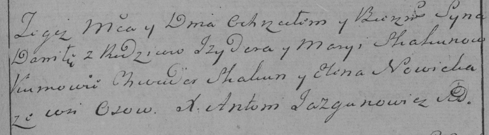

**Скакун Данило Изыдоров (Skakun Daniło)**

9 декабря 1784 г -- крещение (РГИА 823-2-18, лист 228, №27/1784-р
(коп)).

**РГИА 823-2-18:** Лист 228. **Метрическая запись №27/1784-р (коп).**

Дедиловичская Покровская церковь. 9 декабря 1784 года. Метрическая
запись о крещении.

Skakun Daniło -- сын родителей с деревни Осово.

Skakun Jzydor -- отец.

Skakunowa Marya -- мать.

Skakun Chwiedor -- кум.

Nowicka Elena - кума.

Jazgunowicz Antoni -- ксёндз.
