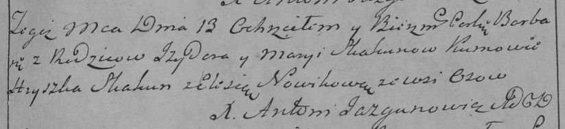

**Скакун Марья (Skakunowa Marya)**

9 декабря 1784 г -- крещение сына Данилы (РГИА 823-2-18, лист 228,
№27/1784-р (коп)).

13 ноября 1787 г -- крещение дочери Варвары (НИАБ 136-13-894, лист 3,
№59/1787-р (ориг)), (РГИА 823-2-18, лист 235, №31/1787-р (коп)).

6 августа 1790 г -- крещение сына Степана (НИАБ 136-13-894, лист 10об,
№56/1790-р (ориг)), (РГИА 823-2-18, лист 240об, №21/1790-р (коп)).

23 октября 1793 г -- крещение дочери Евы (НИАБ 136-13-894, лист 20об,
№74/1793-р (ориг)), (РГИА 823-2-18, лист 248об, №41/1793-р (коп)).

**РГИА 823-2-18:** Лист 228. **Метрическая запись №27/1784-р (коп).**

{width="6.496527777777778in"
height="1.7986111111111112in"}

Дедиловичская Покровская церковь. 9 декабря 1784 года. Метрическая
запись о крещении.

Skakun Daniło -- сын родителей с деревни Осово.

Skakun Jzydor -- отец.

Skakunowa Marya -- мать.

Skakun Chwiedor -- кум.

Nowicka Elena - кума.

Jazgunowicz Antoni -- ксёндз.

**НИАБ 136-13-894:** Лист 3. **Метрическая запись №59/1787-р (ориг).**

{width="6.496527777777778in"
height="0.8917727471566054in"}

Дедиловичская Покровская церковь. 13 ноября 1787 года. Метрическая
запись о крещении.

Skakunowna Barbara -- дочь родителей с деревни Осово.

Skakun Syder -- отец.

Skakunowa \[Ma\]rya -- мать.

Skakun Hryszka - кум.

Nowikowa Elesia - кума.

Jazgunowicz Antoni -- ксёндз.

**РГИА 823-2-18:** Лист 235. **Метрическая запись №31/1787-р (коп).**

{width="6.496527777777778in"
height="1.4916666666666667in"}

Дедиловичская Покровская церковь. 13 ноября 1787 года. Метрическая
запись о крещении.

Skakunowna Barbara -- дочь родителей с деревни Осово.

Skakun Jzydor -- отец.

Skakunowa Marya -- мать.

Skakun Hryszka -- кум.

Nowikowa Elesia - кума.

Jazgunowicz Antoni -- ксёндз.

**НИАБ 136-13-894:** Лист 10об. **Метрическая запись №56/1790-р
(ориг).**

{width="6.496527777777778in"
height="0.8528827646544181in"}

Дедиловичская Покровская церковь. 6 августа 1790 года. Метрическая
запись о крещении.

Skakun Stefan -- сын родителей с деревни Осово.

Skakun Sydor -- отец.

Skakunowa Marya -- мать.

Skakun Hryszka - кум.

Kowalowa Elesia - кума.

Jazgunowicz Antoni -- ксёндз.

**РГИА 823-2-18:** Лист 240об. **Метрическая запись №21/1790-р (коп).**

{width="6.496527777777778in"
height="1.8972222222222221in"}

Дедиловичская Покровская церковь. 6 августа 1790 года. Метрическая
запись о крещении.

Skakun Stefan -- сын родителей с деревни Осово.

Skakun Sider -- отец.

Skakunowa Marya -- мать.

Skakun Hryszko -- кум.

Kowalowa Elesia - кума.

Jazgunowicz Antoni -- ксёндз.

**НИАБ 136-13-894:** Лист 20-об. **Метрическая запись №74/1793-р
(ориг).**

{width="6.496527777777778in"
height="0.8582469378827646in"}

Дедиловичская Покровская церковь. 23 октября 1793 года. Метрическая
запись о крещении.

Skakunowa Ewa -- дочь родителей с деревни Осовo.

Skakun Sider -- отец.

Skakunowa Marya-- мать.

Skakun Hryszka - кум.

Kowalowa Elesia - кума.

Jazgunowicz Antoni -- ксёндз.

**РГИА 823-2-18:** Лист 248об. **Метрическая запись №41/1793-р (коп).**

{width="6.496527777777778in"
height="0.9548611111111112in"}

Дедиловичская Покровская церковь. 23 октября 1793 года. Метрическая
запись о крещении.

Skakunowna Ewa -- дочь родителей с деревни Осово.

Skakun Sidor -- отец.

Skakunowa Marya -- мать.

Skakun Hryszko -- кум.

Kowalowa Elesia -- кума.

Jazgunowicz Antoni -- ксёндз.
