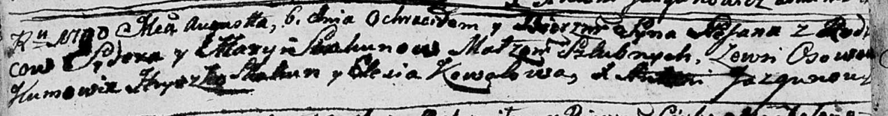
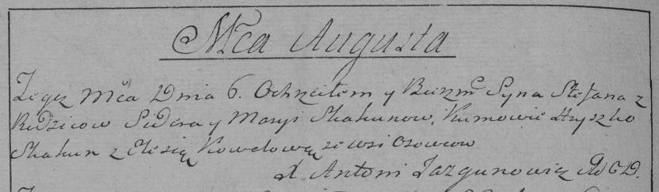

**Скакун Степан Сыдоров (Skakun Stefan)**

6 августа 1790 г -- крещение (НИАБ 136-13-894, лист 10об, №56/1790-р
(ориг)), (РГИА 823-2-18, лист 240об, №21/1790-р (коп)).

**НИАБ 136-13-894:** Лист 10об. **Метрическая запись №56/1790-р
(ориг).**

Дедиловичская Покровская церковь. 6 августа 1790 года. Метрическая
запись о крещении.

Skakun Stefan -- сын родителей с деревни Осово.

Skakun Sydor -- отец.

Skakunowa Marya -- мать.

Skakun Hryszka - кум.

Kowalowa Elesia - кума.

Jazgunowicz Antoni -- ксёндз.

**РГИА 823-2-18:** Лист 240об. **Метрическая запись №21/1790-р (коп).**

Дедиловичская Покровская церковь. 6 августа 1790 года. Метрическая
запись о крещении.

Skakun Stefan -- сын родителей с деревни Осово.

Skakun Sider -- отец.

Skakunowa Marya -- мать.

Skakun Hryszko -- кум.

Kowalowa Elesia - кума.

Jazgunowicz Antoni -- ксёндз.
