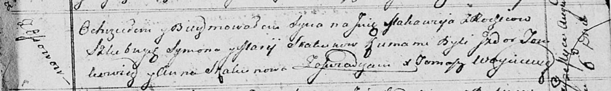

**Скакун Анна Сымонова (Skakunowna Anna Makrena)**

20 июля 1802 г -- крещение (НИАБ 136-13-893, лист 47об, №27/1802-р
(ориг))

**НИАБ 136-13-894:** Лист 47об. **Метрическая запись №27/1802-р
(ориг).**

{width="6.496527777777778in"
height="2.175790682414698in"}

Дедиловичская Покровская церковь. 20 июля 1802 года. Метрическая запись
о крещении.

Skakunowna Anna Makrena -- дочь родителей с деревни Осовo.

Skakun Symon -- отец.

Skakunowa Maryia -- мать.

Tomkowicz Jzydor -- кум.

Skakunowa Ewdokija -- кума.

Jazgunowicz Antoni -- ксёндз.
