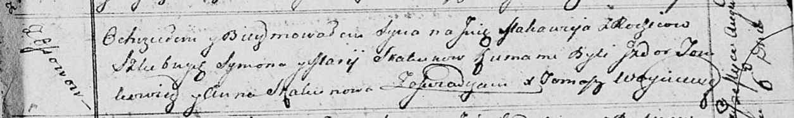

**Скакун Макавей Сымонов (Skakun Makawiey)**

6 августа 1813 г -- крещение (НИАБ 136-13-893, лист 87, №24/1813-р
(ориг))

**НИАБ 136-13-894:** Лист 87. **Метрическая запись №24/1813-р (ориг).**

Осовская Покровская церковь. 6 августа 1813 года. Метрическая запись о
крещении.

Skakun Makawiey -- сын родителей с деревни Осовo.

Skakun Symon -- отец.

Skakunowa Marija -- мать.

Tomkowicz Jzydor -- кум.

Skakunowa Anna -- кума.

Woyniewicz Tomasz -- ксёндз.
