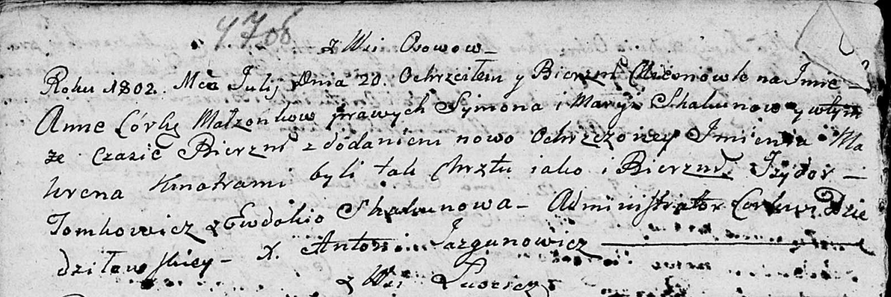

**Скакун Сымон (Skakun Symon)**

8 ноября 1799 г -- венчание с Марией Скакун (НИАБ 136-13-893, лист 6об,
№7/1799-б (ориг), НИАБ 136-13-893, лист 6об, №7/1799-б (ориг))

20 июля 1802 г -- крещение дочери Анны Макрены (НИАБ 136-13-893, лист
47об, №27/1802-р (ориг))

6 января 1810 г -- крещение сына Адама (НИАБ 136-13-893, лист 76об,
№2/1810-р (ориг))

6 августа 1813 г -- крещение сына Макавея (НИАБ 136-13-893, лист 87,
№24/1813-р (ориг))

**НИАБ 136-13-920:** Лист 6об. **Метрическая запись №7/1799-б (ориг).**

{width="6.496527777777778in"
height="1.017156605424322in"}

Дедиловичская Покровская церковь. 8 ноября 1799 года. Метрическая запись
о венчании.

Skakun Symon -- жених с деревни \[Осово\].

Skakunowna Marya -- невеста.

Skakun Leon -- свидетель.

Suszko Cimachwiey -- свидетель.

Jazgunowicz Antoni -- ксёндз.

**НИАБ 136-13-938:** Лист 248об. **Метрическая запись №7/1799-б (коп).**

(См. тж. НИАБ 136-13-920, лист 6об, №7/1799-б (ориг))

{width="6.496527777777778in"
height="3.2159722222222222in"}

Дедиловичская Покровская церковь. 8 ноября 1799 года. Метрическая запись
о венчании.

Skakun Symon -- жених, молодой, с деревни \[Осово\].

Skakunowa Marya -- невеста.

Skakun Leon -- свидетель, с деревни Клинники.

Suszko Cimachwiey -- свидетель, с деревни Горелое.

Jazgunowicz Antoni -- ксёндз.

**НИАБ 136-13-894:** Лист 47об. **Метрическая запись №27/1802-р
(ориг).**

{width="6.496527777777778in"
height="2.175790682414698in"}

Дедиловичская Покровская церковь. 20 июля 1802 года. Метрическая запись
о крещении.

Skakunowna Anna Makrena -- дочь родителей с деревни Осовo.

Skakun Symon -- отец.

Skakunowa Maryia -- мать.

Tomkowicz Jzydor -- кум.

Skakunowa Ewdokija -- кума.

Jazgunowicz Antoni -- ксёндз.

**НИАБ 136-13-894:** Лист 76об. **Метрическая запись №2/1810-р (ориг).**

{width="6.496527777777778in"
height="2.108069772528434in"}

Дедиловичская Покровская церковь. 6 января 1810 года. Метрическая запись
о крещении.

Skakun Adam -- сын родителей из деревни Осовo.

Skakun Symon -- отец.

Skakunowa Marya -- мать.

Tomkowicz Jzydor -- кум.

Czaplaiowa Ewdokija -- кума.

Jazgunowicz Antoni -- ксёндз.

**НИАБ 136-13-894:** Лист 87. **Метрическая запись №24/1813-р (ориг).**

{width="6.496527777777778in"
height="0.9729035433070866in"}

Осовская Покровская церковь. 6 августа 1813 года. Метрическая запись о
крещении.

Skakun Makawiey -- сын родителей с деревни Осовo.

Skakun Symon -- отец.

Skakunowa Marija -- мать.

Tomkowicz Jzydor -- кум.

Skakunowa Anna -- кума.

Woyniewicz Tomasz -- ксёндз.
