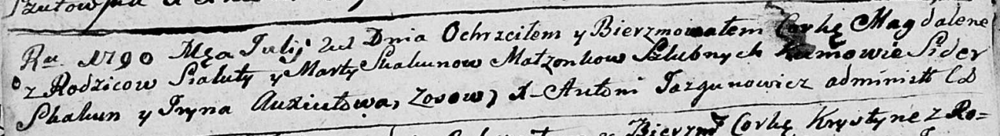

**Скакун Сялюта, Сыльвестер (Skakun Sialuta, Sylwester)**

21 июля 1790 г -- крещение дочери Магдалены (НИАБ 136-13-893, лист 10об,
№48/1790-р (ориг))

**НИАБ 136-13-894:** Лист 10об. **Метрическая запись №48/1790-р
(ориг).**

{width="6.496527777777778in"
height="0.888419728783902in"}

Дедиловичская Покровская церковь. 21 июля 1790 года. Метрическая запись
о крещении.

Skakunowna Magdalena -- дочь родителей с деревни Осово.

Skakun Sialuta -- отец.

Skakunowa Marta -- мать.

Skakun Sider - кум.

Axiutowa Jryna - кума.

Jazgunowicz Antoni -- ксёндз.
