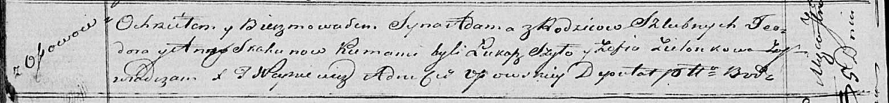

**Скакун Адам Тодоров (Skakun Adam)**

5 сентября 1820 г -- крещение (НИАБ 136-13-893, лист 104об, №29/1820-р
(ориг))

**НИАБ 136-13-894:** Лист 104об. **Метрическая запись №29/1820-р
(ориг).**

Осовская Покровская церковь. 5 сентября 1820 года. Метрическая запись о
крещении.

Skakun Adam -- сын родителей с деревни Осовo.

Skakun Teodor -- отец.

Skakunowa Anna -- мать.

Szyło Łukaz -- кум.

Zielonkowa Zofija -- кума.

Woyniewicz Tomasz -- ксёндз.
