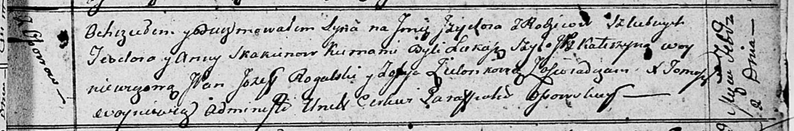

**Скакун Изыдор Тодоров (Skakun Jzydor)**

2 февраля 1813 г -- крещение (НИАБ 136-13-893, лист 86, №2/1813-р
(ориг))

**НИАБ 136-13-894:** Лист 86. **Метрическая запись №2/1813-р (ориг).**

Осовская Покровская церковь. 2 февраля 1813 года. Метрическая запись о
крещении.

Skakun Jzydor -- сын родителей с деревни Осовo.

Skakun Teodor -- отец.

Skakunowa Anna -- мать.

Szyło Łukasz -- кум.

Woyniczowa Katerzyna, JP -- кума, шляхтянка.

Rogalski Jozef, JP -- ассистент, шляхтич.

Zielonkowa Zofija -- ассистентка.

Woyniewicz Tomasz -- ксёндз.
