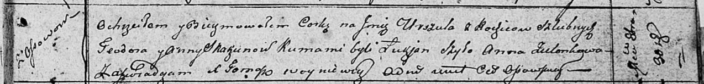

**Скакун Уршуля Тодорова (Skakunowna Urszula)**

30 октября 1810 г -- крещение (НИАБ 136-13-893, лист 79, №52/1810-р
(ориг))

**НИАБ 136-13-894:** Лист 79. **Метрическая запись №52/1810-р (ориг).**

Осовская Покровская церковь. 30 октября 1810 года. Метрическая запись о
крещении.

Skakunowna Urszula -- дочь родителей с деревни Осовo.

Skakun Teodor -- отец.

Skakunowa Anna -- мать.

Szyło Łukjan -- кум.

Zielonkowa Anna -- кума.

Woyniewicz Tomasz -- ксёндз.
