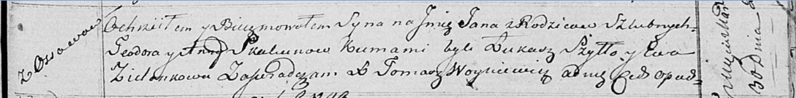

**Скакун Ян Тодоров (Skakun Jan)**

30 марта 1818 г -- крещение (НИАБ 136-13-893, лист 98, №11/1818-р
(ориг))

**НИАБ 136-13-894:** Лист 98. **Метрическая запись №11/1818-р (ориг).**

{width="6.496527777777778in"
height="0.8066185476815398in"}

Осовская Покровская церковь. 30 марта 1818 года. Метрическая запись о
крещении.

Skakun Jan -- сын родителей с деревни Осовo.

Skakun Teodor -- отец.

Skakunowa Anna -- мать.

Szyło Łukasz -- кум.

Zielonkowa Ewa -- кума.

Woyniewicz Tomasz -- ксёндз.
