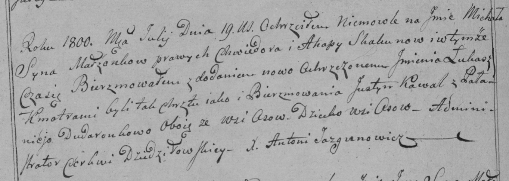

**Скакун (Войнич) Агапа (Skakunowa Ahapa, Ahafija z Woyniczow)**

20 января 1796 г -- венчание с Хведором Скакуном с деревни Осово (НИАБ
136-13-920, лист 2об, №1/1796-б (ориг)).

18 июля 1800 г -- крещение сына Михала Павла (НИАБ 136-13-893, лист
41об, №19/1800-р (ориг), РГИА 823-2-18, лист 276об, №18/1800-р (коп),
НИАБ 136-13-949, лист 102об, №19/1800-р (коп), НИАБ 136-13-949, лист
103, №21/1800-р (коп)).

8 ноября 1802 г -- крещение сына Павла (НИАБ 136-13-893, лист 48об,
№40/1802-р (ориг))

10 мая 1803 г -- возможно, крестная мать Миколая Бенедыкта, сына Чапляев
Яна и Ксени с деревни Осово (НИАБ 136-13-894, лист 50об, №21/1803-р
(ориг)).

18 июня 1804 г -- крещение сына Миколая Сергея (НИАБ 136-13-893, лист
57об, №28/1805-р (ориг))

17 сентября 1808 г -- крещение дочери Текли (НИАБ 136-13-893, лист 72,
№31/1808-р (ориг))

29 ноября 1808 г -- вероятно, крестная мать Адама, сына Аксют Андрея и
Магдуси с деревни Осово (НИАБ 136-13-894, лист 73, №45/1808-р (ориг)).

**НИАБ 136-13-920:** Лист 2об. **Метрическая запись №1/1796-б (ориг).**

{width="6.496527777777778in"
height="1.453655949256343in"}

Дедиловичская Покровская церковь. 20 января 1796 года. Метрическая
запись о венчании.

Skakun Chwiedor -- жених, деревня Осовo.

Woyniczowa Ahapa -- невеста, девка, деревня Осовo.

Skakun Klemiata -- свидетель.

Woynicz Paweł -- свидетель, с деревни Осово.

Jazgunowicz Antoni -- ксёндз.

**НИАБ 136-13-894:** Лист 41об. **Метрическая запись №19/1800-р
(ориг).**

{width="6.496527777777778in"
height="1.116392169728784in"}

Дедиловичская Покровская церковь. 18 июля 1800 года. Метрическая запись
о крещении.

Skakun Michal Paweł -- сын родителей с деревни Осовo.

Skakun Chwiedor -- отец.

Skakunowa Ahapa -- мать.

Kawal Justyn -- кум.

Dudaronkowa Pałanieja -- кума.

Jazgunowicz Antoni -- ксёндз.

**РГИА 823-2-18:** Лист 276об. **Метрическая запись №18/1800-р (коп).**

{width="6.496527777777778in"
height="2.321527777777778in"}

Дедиловичская Покровская церковь. \[18\] июля 1800 года. Метрическая
запись о крещении.

Skakun Michał Łukasz -- сын родителей с деревни Осово.

Skakun Chwiedor -- отец.

Skakunowa Ahapa -- мать.

Kawal Justyn -- кум, с деревни Осово.

Dudaronkowa Pałanieja -- кума, с деревни Осово.

Jazgunowicz Antoni -- ксёндз.

**НИАБ 136-13-949:** Лист 102об. **Метрическая запись №19/1800-р
(коп).**

(См. тж.: РГИА 823-2-18, лист 276об, №18/1800-р (коп), НИАБ 136-13-894,
лист 41об, №19/1800-р (ориг))

{width="6.496527777777778in"
height="2.015277777777778in"}

Дедиловичская Покровская церковь. 18 июля 1800 года. Метрическая запись
о крещении.

Skakun Michał Paweł -- сын родителей с деревни Осово.

Skakun Chwiedor -- отец.

Skakunowa Ahapa -- мать.

Kawal Justyn -- кум, с деревни Осово.

Dudaronkowa Pałanieja - кума.

Jazgunowicz Antoni -- ксёндз.

**НИАБ 136-13-949:** Лист 103. **Метрическая запись №21/1800-р (коп).
(**См. тж. Лист 102об. Метрическая запись №19/1800-р (коп))

(См. тж.: РГИА 823-2-18, лист 276об, №18/1800-р (коп), НИАБ 136-13-894,
лист 41об, №19/1800-р (ориг))

{width="6.496527777777778in"
height="2.698611111111111in"}

Дедиловичская Покровская церковь. 18 июля 1800 года. Метрическая запись
о крещении.

Skakun Michał Paweł -- сын родителей с деревни Осово.

Skakun Chwiedor -- отец.

Skakunowa Ahafia -- мать.

Kowal Justyn -- кум, с деревни Осово.

Dudaronkowa Pałanieja - кума, с деревни Осово.

Jazgunowicz Antoni -- ксёндз.

**НИАБ 136-13-894:** Лист 48об. **Метрическая запись №40/1802-р
(ориг).**

{width="6.496527777777778in"
height="0.9615048118985127in"}

Дедиловичская Покровская церковь. 8 ноября 1802 года. Метрическая запись
о крещении.

Skakun Paweł -- сын родителей с деревни Осовo.

Skakun Chwiedor -- отец.

Skakunowa Ahafija -- мать.

Kowal Justyn -- кум.

Kisczanko Chodora -- кума.

Jazgunowicz Antoni -- ксёндз.

**НИАБ 136-13-894:** Лист 50об. **Метрическая запись №21/1803-р
(ориг).**

{width="6.496527777777778in"
height="1.4462806211723536in"}

Дедиловичская Покровская церковь. 10 мая 1803 года. Метрическая запись о
крещении.

Czaplay Mikołay Benedykt -- сын родителей с деревни Осовo.

Czaplaj Jan -- отец.

Czaplaiowa Xienia -- мать.

Kowal Sylwester -- кум, с деревни Осовo.

Skakunowa Ahafia -- кума, с деревни Осовo.

Jazgunowicz Antoni -- ксёндз.

**НИАБ 136-13-894:** Лист 57об. **Метрическая запись №28/1805-р
(ориг).**

{width="6.496527777777778in"
height="1.1277898075240596in"}

Дедиловичская Покровская церковь. 18 июня 1805 года. Метрическая запись
о крещении.

Skakun Mikołay Jerzy -- сын родителей с деревни Осовo.

Skakun Chwiedor -- отец.

Skakunowa Ahapa -- мать.

Kawal Justyn -- кум.

Dudaronkowa Palucha -- кума.

Jazgunowicz Antoni -- ксёндз.

**НИАБ 136-13-894:** Лист 72. **Метрическая запись №31/1808-р (ориг).**

{width="6.496527777777778in"
height="1.68498031496063in"}

Дедиловичская Покровская церковь. 17 сентября 1808 года. Метрическая
запись о крещении.

Skakunowna Tekla -- дочь родителей с деревни Осово.

Skakun Chwiedor -- отец.

Skakunowa Ahapa -- мать.

Ertman Jozef, JP -- кум, шляхтич.

Dudaronkowa Palucha -- кума.

Jazgunowicz Antoni -- ксёндз.

**НИАБ 136-13-894:** Лист 73. **Метрическая запись №45/1808-р (ориг).**

{width="6.496527777777778in"
height="0.8522123797025372in"}

Дедиловичская Покровская церковь. 29 ноября 1808 года. Метрическая
запись о крещении.

Axiuta Adam -- сын родителей с деревни Осово.

Axiuta Andrzey -- отец.

Axiutowa Magdusia -- мать.

Dudaronek Taras -- кум, с деревни Осово.

Skakunowa Ahapa -- кума, с деревни Осово.

Jazgunowicz Antoni -- ксёндз.
