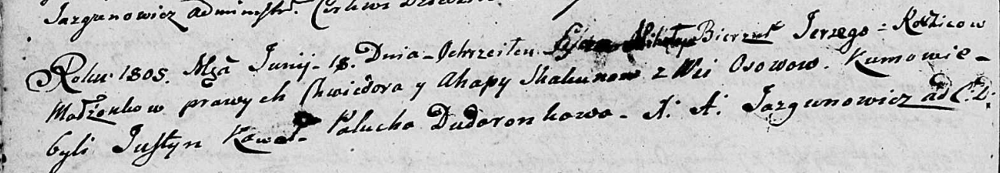

**Скакун Миколай Хведоров (Skakun Mikołay Jerzy)**

18 июня 1804 г -- крещение (НИАБ 136-13-893, лист 57об, №28/1805-р
(ориг))

**НИАБ 136-13-894:** Лист 57об. **Метрическая запись №28/1805-р
(ориг).**

{width="6.496527777777778in"
height="1.1277898075240596in"}

Дедиловичская Покровская церковь. 18 июня 1805 года. Метрическая запись
о крещении.

Skakun Mikołay Jerzy -- сын родителей с деревни Осовo.

Skakun Chwiedor -- отец.

Skakunowa Ahapa -- мать.

Kawal Justyn -- кум.

Dudaronkowa Palucha -- кума.

Jazgunowicz Antoni -- ксёндз.
