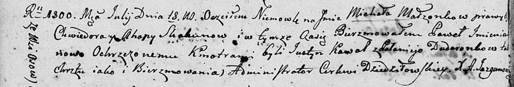

**Скакун Михал Хведоров (Skakun Michał Paweł)**

18 июля 1800 г -- крещение (НИАБ 136-13-893, лист 41об, №19/1800-р
(ориг), РГИА 823-2-18, лист 276об, №18/1800-р (коп), НИАБ 136-13-949,
лист 102об, №19/1800-р (коп), НИАБ 136-13-949, лист 103, №21/1800-р
(коп)).

**НИАБ 136-13-894:** Лист 41об. **Метрическая запись №19/1800-р
(ориг).**

Дедиловичская Покровская церковь. 18 июля 1800 года. Метрическая запись
о крещении.

Skakun Michal Paweł -- сын родителей с деревни Осовo.

Skakun Chwiedor -- отец.

Skakunowa Ahapa -- мать.

Kawal Justyn -- кум.

Dudaronkowa Pałanieja -- кума.

Jazgunowicz Antoni -- ксёндз.

**РГИА 823-2-18:** Лист 276об. **Метрическая запись №18/1800-р (коп).**

Дедиловичская Покровская церковь. \[18\] июля 1800 года. Метрическая
запись о крещении.

Skakun Michał Łukasz -- сын родителей с деревни Осово.

Skakun Chwiedor -- отец.

Skakunowa Ahapa -- мать.

Kawal Justyn -- кум, с деревни Осово.

Dudaronkowa Pałanieja -- кума, с деревни Осово.

Jazgunowicz Antoni -- ксёндз.

**НИАБ 136-13-949:** Лист 102об. **Метрическая запись №19/1800-р
(коп).**

(См. тж.: РГИА 823-2-18, лист 276об, №18/1800-р (коп), НИАБ 136-13-894,
лист 41об, №19/1800-р (ориг))

Дедиловичская Покровская церковь. 18 июля 1800 года. Метрическая запись
о крещении.

Skakun Michał Paweł -- сын родителей с деревни Осово.

Skakun Chwiedor -- отец.

Skakunowa Ahapa -- мать.

Kawal Justyn -- кум, с деревни Осово.

Dudaronkowa Pałanieja - кума.

Jazgunowicz Antoni -- ксёндз.

**НИАБ 136-13-949:** Лист 103. **Метрическая запись №21/1800-р (коп).
(**См. тж. Лист 102об. Метрическая запись №19/1800-р (коп))

(См. тж.: РГИА 823-2-18, лист 276об, №18/1800-р (коп), НИАБ 136-13-894,
лист 41об, №19/1800-р (ориг))

Дедиловичская Покровская церковь. 18 июля 1800 года. Метрическая запись
о крещении.

Skakun Michał Paweł -- сын родителей с деревни Осово.

Skakun Chwiedor -- отец.

Skakunowa Ahafia -- мать.

Kowal Justyn -- кум, с деревни Осово.

Dudaronkowa Pałanieja - кума, с деревни Осово.

Jazgunowicz Antoni -- ксёндз.
