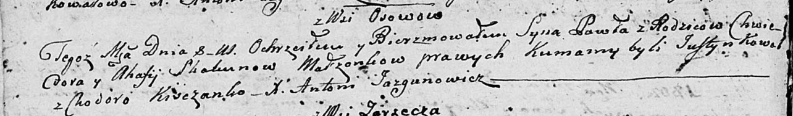

**Скакун Павел Хведоров (Skakun Paweł)**

8 ноября 1802 г -- крещение сына Павла (НИАБ 136-13-893, лист 48об,
№40/1802-р (ориг))

**НИАБ 136-13-894:** Лист 41об. **Метрическая запись №19/1800-р
(ориг).**

{width="6.496527777777778in"
height="1.116392169728784in"}

Дедиловичская Покровская церковь. 18 июля 1800 года. Метрическая запись
о крещении.

Skakun Michal Paweł -- сын родителей с деревни Осовo.

Skakun Chwiedor -- отец.

Skakunowa Ahapa -- мать.

Kawal Justyn -- кум.

Dudaronkowa Pałanieja -- кума.

Jazgunowicz Antoni -- ксёндз.

**НИАБ 136-13-894:** Лист 48об. **Метрическая запись №40/1802-р
(ориг).**

{width="6.496527777777778in"
height="0.9615048118985127in"}

Дедиловичская Покровская церковь. 8 ноября 1802 года. Метрическая запись
о крещении.

Skakun Paweł -- сын родителей с деревни Осовo.

Skakun Chwiedor -- отец.

Skakunowa Ahafija -- мать.

Kowal Justyn -- кум.

Kisczanko Chodora -- кума.

Jazgunowicz Antoni -- ксёндз.
