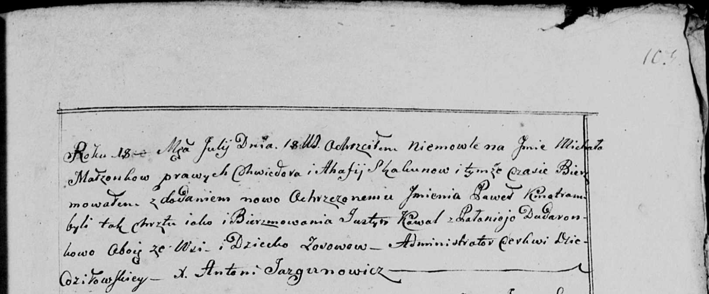

**Скакун Текля Хведорова (Skakunowna Tekla)**

17 сентября 1808 г -- крещение (НИАБ 136-13-893, лист 72, №31/1808-р
(ориг))

**НИАБ 136-13-894:** Лист 72. **Метрическая запись №31/1808-р (ориг).**

{width="6.496527777777778in"
height="1.68498031496063in"}

Дедиловичская Покровская церковь. 17 сентября 1808 года. Метрическая
запись о крещении.

Skakunowna Tekla -- дочь родителей с деревни Осово.

Skakun Chwiedor -- отец.

Skakunowa Ahapa -- мать.

Ertman Jozef, JP -- кум, шляхтич.

Dudaronkowa Palucha -- кума.

Jazgunowicz Antoni -- ксёндз.
