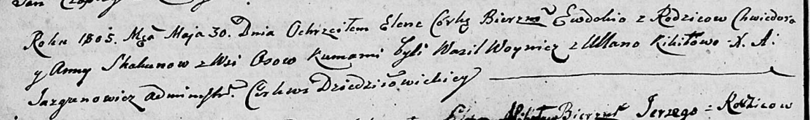

**Скакун Елена Хведорова (Skakunowna Elena Ewdokija)**

30 мая 1805 г -- крещение (НИАБ 136-13-893, лист 57об, №27/1805-р
(ориг))

**НИАБ 136-13-894:** Лист 57об. **Метрическая запись №27/1805-р
(ориг).**

{width="6.496527777777778in"
height="0.9722331583552056in"}

Дедиловичская Покровская церковь. 30 мая 1805 года. Метрическая запись о
крещении.

Skakunowna Elena Ewdokija -- дочь родителей с деревни Осовo.

Skakun Chwiedor -- отец.

Skakunowa Anna -- мать.

Woynicz Wasil -- кум.

Kikiłowa Ullana -- кума.

Jazgunowicz Antoni -- ксёндз.
